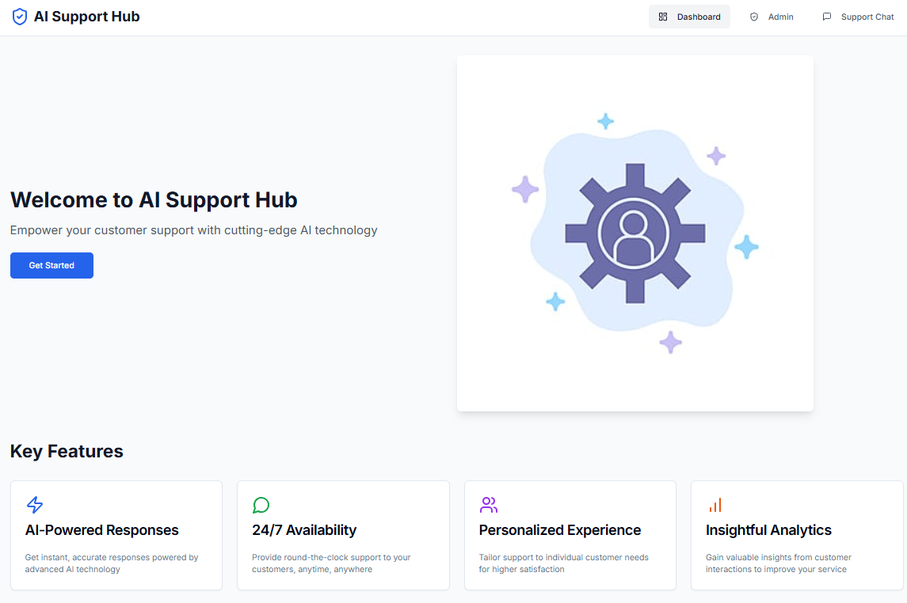

# Resolve-X: Automated Consumer Disputes Resolution

This is a simple Flask-based backend system for managing customer service interactions, including chat history, feedback, and analytics. The system leverages AI to generate responses to customer queries and allows the admin to manage and monitor the interactions securely. It ensures the **integrity** and **security** of the consumer's data by implementing encryption mechanisms (using Fernet).

## Features
- **Chat History**: Stores customer interactions, both from the user and the assistant.
- **Customer Feedback**: Allows admins to manage and view feedback from users, including ratings and comments.
- **Analytics**: Tracks important metrics such as total number of chats, average rating, and response time.
- **Data Encryption**: Encrypts sensitive data (such as user prompts) using **Fernet encryption** for enhanced security.
- **Admin Dashboard**: A React-based frontend that allows admins to view and manage chat history, feedback, and analytics.

## Setting Up the Project

### Backend (Flask API)

1. Create a virtual environment (optional but recommended).
2. Install required dependencies by running the appropriate package manager.
3. Set the `GEMINI_API_KEY` in the environment or replace the key in the code with your own. You can generate the API key from Google Cloud's **Gemini API** platform.
4. Run the Flask server. The Flask backend will now be running on `http://127.0.0.1:5000`.

### Frontend (React Admin Dashboard)

1. Change to the frontend directory.
2. Install required dependencies.
3. Run the React development server. The admin dashboard will now be accessible on `http://localhost:3000`.

## API Endpoints

### `/api/get-chat-history` (GET)
- Returns the chat history, including both user and assistant messages.

### `/api/get-feedback` (GET)
- Returns the feedback submitted by users.

### `/api/get-analytics` (GET)
- Returns analytics data like total chats, average rating, and response time.

### `/api/add-chat` (POST)
- Allows admins to add new chat entries to the system.

### `/api/add-feedback` (POST)
- Allows admins to add feedback from users.

### `/api/update-analytics` (POST)
- Allows admins to update analytics data, such as total chats or response time.

## Security Considerations

- **Data Encryption**: All sensitive user data is encrypted using **Fernet encryption** before storage or transmission.
- **API Security**: All API endpoints use HTTPS to ensure secure communication. Additionally, secure key management for encryption ensures that only authorized parties can access or decrypt data.
- **Access Control**: Admin access is protected, and only authorized users can modify feedback, chat history, or analytics.

## Technologies Used
- **Backend**: Flask (Python)
- **Frontend**: React.js
- **AI**: Google Gemini API for generating AI responses
- **Encryption**: Fernet (from Python’s cryptography library)

## Future Enhancements
- **Authentication**: Implement proper authentication for admin access to the dashboard.
- **Data Persistence**: Use a database (e.g., PostgreSQL, MySQL) instead of in-memory storage for scaling purposes.
- **More Analytics**: Add additional analytics like response accuracy, user satisfaction ratings, etc.
- **AI Model Tuning**: Fine-tune the AI model for better customer interaction handling.

## App Screenshots

### Dashboard

### Customer Support

### Admin Dashboard

